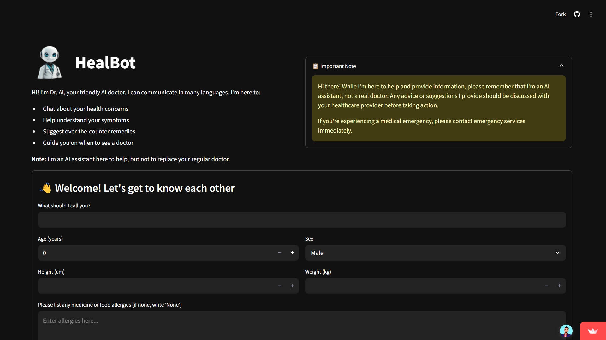
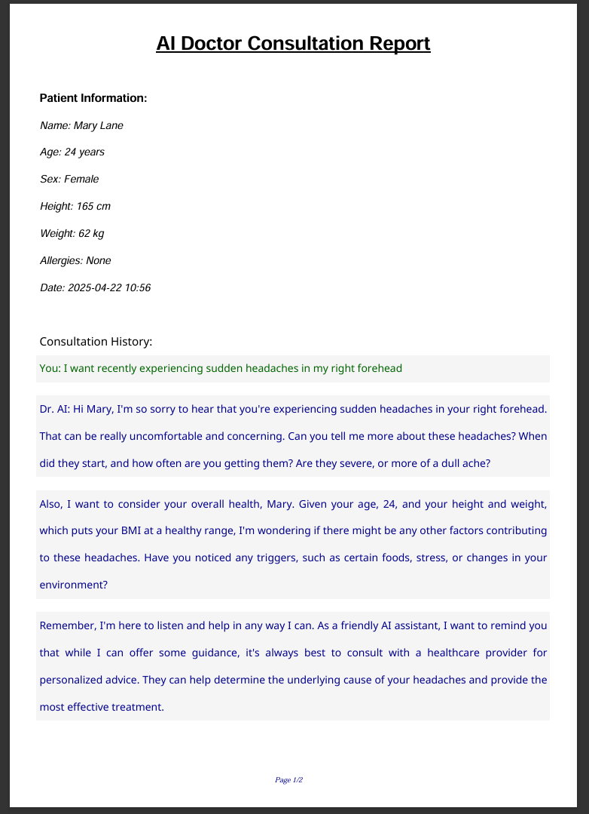

# HealBot: AI Medical Assistant


---

## 🌐 Live Demo

Try HealBot instantly on Streamlit Cloud:

[**▶️ Launch Live App**](https://healbot.streamlit.app/)

---

## 🤖 Overview

**HealBot** is an AI-powered medical assistant web app built with Streamlit. It provides friendly, empathetic, and multilingual health consultations, helping users understand symptoms, get over-the-counter remedy suggestions, and know when to seek professional care. HealBot is designed to be accessible, visually appealing, and easy to use for everyone.

> **Note:** HealBot is an AI assistant and does **not** replace professional medical advice. Always consult a healthcare provider for serious concerns.

---

## ✨ Features

- **Conversational AI Doctor**: Chat with "Dr. AI" for health advice in a warm, easy-to-understand manner.
- **Personalized Consultations**: Considers your age, sex, height, weight, and allergies for tailored advice.
- **Allergy-Aware Recommendations**: Medication suggestions always cross-checked with your listed allergies.
- **Multilingual Support**: Communicates in multiple Indian languages.
- **PDF Consultation Reports**: Download your chat history as a professional-looking PDF.
- **Modern, Responsive UI**: Clean, dark-themed interface with custom fonts and icons.

---

## 🚀 Getting Started

### 1. **Clone the Repository**
```bash
git clone https://github.com/yourusername/ai_doc_healbot.git
cd ai_doc_healbot
```

### 2. **Install Dependencies**
Make sure you have Python 3.8+ and pip installed.
```bash
pip install -r requirements.txt
```

### 3. **Set Up API Key**
- Obtain a `GROQ_API_KEY` and add it to your Streamlit secrets (e.g., in `.streamlit/secrets.toml`):
  ```toml
  GROQ_API_KEY = "your_groq_api_key_here"
  ```

### 4. **Run the App**
```bash
streamlit run app.py
```
The app will open in your browser at [http://localhost:8501](http://localhost:8501).

---

## 🖥️ Usage Guide

1. **Enter Your Details**: Name, age, sex, height, weight, and allergies (if any, else enter 'None').
2. **Start Chatting**: Describe your symptoms or ask health questions.
3. **Download Report**: Save your consultation as a PDF from the sidebar.
4. **Start New Chat/Consultation**: Use sidebar controls to reset the conversation or patient info.

---

## 🛠️ Tech Stack
- **Python 3**
- **Streamlit** (UI & web app framework)
- **Groq API** (AI chat engine)
- **FPDF2** (PDF report generation)
- **Custom Fonts** (NotoSans)

---

## 📸 Screenshots

> _Add screenshots of the app interface here_

| Chat Interface | PDF Report |
|:--------------:|:----------:|
|  |  |

---

## 📄 License

This project is licensed under the MIT License. See [LICENSE](LICENSE) for details.

---

## 🙏 Credits

- Developed by **Aayush Goswami**
- Icon and font assets from open sources
- Powered by [Groq](https://groq.com/) and [Streamlit](https://streamlit.io/)

---

## 💡 Disclaimer

HealBot is for informational purposes only and does not provide medical diagnosis or treatment. For emergencies, contact your local healthcare provider immediately.